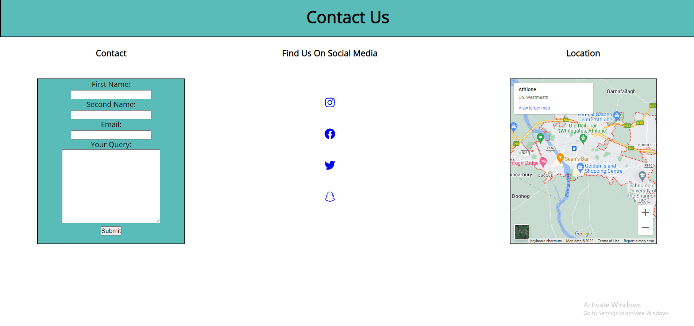

# Athlone Gym

Athlone gym is a website for a gym based in Athlone.
It contains information about the gym such as the services and classes it provides. Users can contact the gym with a contact form and also sign up to the gym with a sign up form.

## Features

### Header

- This section includes the main heading and navagation bar. The navagation bar includes links to four different sections of the website. When the user hovers over one link, the background color changes to show that it is being targeted.

### About section

- The about section gives the user information about the gym and a list of reasons to join. The background has an a dark image of a barbell which contrasts well with the bright font color.

### Classes section

- The classes section will show the user the types of classes offered by the gym. It also includes the timetable and an image of each class.

### Sign up section

- This section has a signup form for the user if they wish to sign up to the gyms services.

### Footer

- The footer includes three sections. A contact form and links to the gyms social media's. It also includes the location of the gym in an embedded google map.

## Testing

- I made sure that the page loads in different browsers. I used inspect element to scale the page down and check how responsive it was to different screen sizes

## Validator Testing

- HTML:
I copied and pasted my HTML code into the W3C validator and fixed all the errors it showed.
- CSS:
I alsoe copied and pasted my CSS code with the W3C CSS validator and received no errors.
- Accessibility: 
Using Lighthouse in inspect element, I made sure the accessibility was close to 100%

## Deployment

- I deployed this website using Github pages.
1. In the github page for the repository, go to the pages tab in settings.
2. From the source, select Main in Branch and save it.
3. Refresh page.

- Athlone Gym can be reached here: [Athlone Gym](https://thomas-longworth.github.io/PP1/)

## Credits

#### Content
- In the two forms, I took some code for the inputs from the forms module in Code Institue's HTML essentials.
- The icons in the Footer section and Header section were taken from Font Awesome

#### Media
- The photos used in the About section and Classes section are taken from Pexels.com and Istockphotos.com
